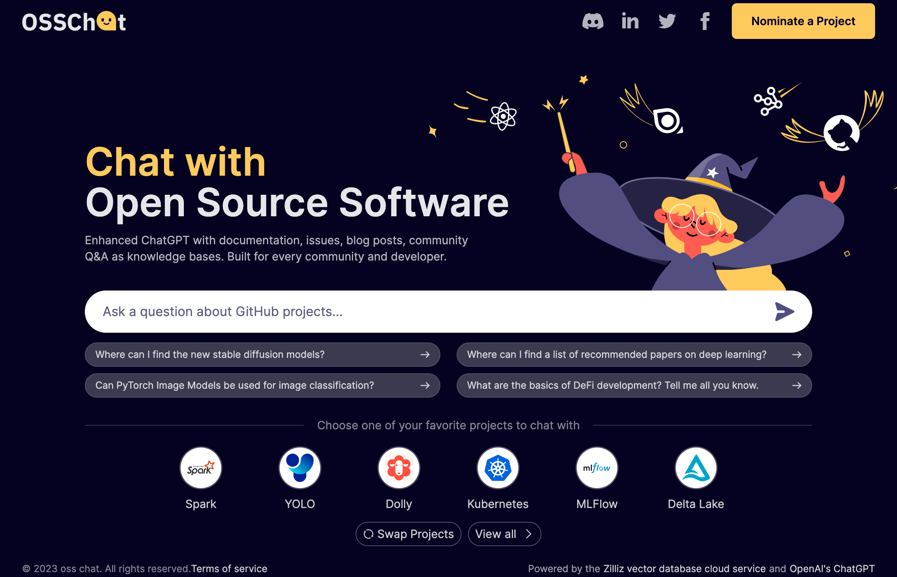

# Akcio: Enhancing LLM-Powered ChatBot with CVP Stack

[OSSChat](https://osschat.io) |
[Documentation](https://github.com/zilliztech/akcio/wiki) |
[Contact](https://zilliz.com/contact-sales) |
[LICENSE](./LICENSE)

Index

- [Overview](#overview)
- [Deployment](#deployment)
- [Load Data](#load-data)
- [Notice](#notice)

ChatGPT has constraints due to its limited knowledge base, sometimes resulting in hallucinating answers when asked about unfamiliar topics. We are introducing the new AI stack, ChatGPT+Vector database+prompt-as-code, or the CVP Stack, to overcome this constraint.

We have built [OSSChat](https://osschat.io) as a working demonstration of the CVP stack. Now we are presenting the technology behind OSSChat in this repository with a code name of Akcio.



With this project, you are able to build a knowledge-enhanced ChatBot using LLM service like ChatGPT. 
By the end, you will learn how to start a backend service using FastAPI, which provides standby APIs to support further applications. Alternatively, we show how to use Gradio to build an online demo with user interface.

## Overview


Akcio allows you to create a ChatGPT-like system with added intelligence obtained through semantic search of customized knowledge base.
Instead of sending the user query directly to LLM service, our system firstly retrieves relevant information from stores by semantic search or keyword match. Then it feeds both user needs and helpful information into LLM. This allows LLM to better tailor its response to the user's needs and provide more accurate and helpful information.

You can find more details and instructions at our [documentation](https://github.com/zilliztech/akcio/wiki).

Akcio offers two AI platforms to choose from: [Towhee](https://towhee.io) or [LangChain](https://langchain.com).
It also supports different integrations of LLM service and databases:

|                         |              | **Towhee** | **LangChain** |
|:-----------------------:|:------------:|:------:|:-----:|
| **LLM**                 | OpenAI       | ✓      | ✓     |
|                         | Llama-2      | ✓      |       |
|                         | Dolly        | ✓      | ✓     |
|                         | Ernie        | ✓      | ✓     |
|                         | MiniMax      | ✓      | ✓     |
|                         | DashScope    | ✓      |       |
|                         | ChatGLM      | ✓      |       |
|                         | SkyChat      | ✓      |       |
| **Embedding**           | OpenAI       | ✓      | ✓     |
|                         | HuggingFace  | ✓      | ✓     |
| **Vector Store**        | Zilliz Cloud | ✓      | ✓     |
|                         | Milvus       | ✓      | ✓     |
| **Scalar Store (Optional)** | Elastic  | ✓      | ✓     |
| **Memory Store**        | Postgresql   | ✓      | ✓     |
|                         | MySQL and MariaDB     | ✓     |       |
|                         | SQLite       | ✓      |       |
|                         | Oracle       | ✓      |       |
|                         | Microsoft SQL Server  | ✓     |       |
| **Rerank**              | MS MARCO Cross-Encoders | ✓ | |

### Option 1: Towhee

The option using Towhee simplifies the process of building a system by providing [pre-defined pipelines](https://towhee.io/tasks/pipeline). These built-in pipelines require less coding and make system building much easier. If you require customization, you can either simply modify configuration or create your own pipeline with rich options of [Towhee Operators](https://towhee.io/tasks/operator).

- [Pipelines](./src_towhee/pipelines)
    - **Insert:**
        The insert pipeline builds a knowledge base by saving documents and corresponding data in database(s).
    - **Search:**
        The search pipeline enables the question-answering capability powered by information retrieval (semantic search and optional keyword match) and LLM service.
    - **Prompt:** a prompt operator prepares messages for LLM by assembling system message, chat history, and the user's query processed by template.

- [Memory](./src_towhee/memory):
    The memory storage stores chat history to support context in conversation. (available: [most SQL](./src_towhee/memory/sql.py))


### Option 2: LangChain

The option using LangChain employs the use of [Agent](https://python.langchain.com/docs/modules/agents) in order to enable LLM to utilize specific tools, resulting in a greater demand for LLM's ability to comprehend tasks and make informed decisions.

- [Agent](./src_langchain/agent)
    - **ChatAgent:** agent ensembles all modules together to build up qa system.
    - Other agents (todo)
- [LLM](./src_langchain/llm)
    - **ChatLLM:** large language model or service to generate answers.
- [Embedding](./src_langchain/embedding/)
    - **TextEncoder:** encoder converts each text input to a vector.
    - Other encoders (todo)
- [Store](./src_langchain/store)
    - **VectorStore:** vector database stores document chunks in embeddings, and performs document retrieval via semantic search.
    - **ScalarStore:** optional, database stores metadata for each document chunk, which supports additional information retrieval. (available: [Elastic](src_langchain/store/scalar_store/es.py))
    - **MemoryStore:** memory storage stores chat history to support context in conversation.
- [DataLoader](./src_langchain/data_loader/)
    - **DataParser:** tool loads data from given source and then splits documents into processed doc chunks.

## Deployment

1. Downloads
    ```shell
    $ git clone https://github.com/zilliztech/akcio.git
    $ cd akcio
    ```

2. Install dependencies
    ```shell
    $ pip install -r requirements.txt
    ```

3. Configure modules

    You can configure all arguments by modifying [config.py](./config.py) to set up your system with default modules.

    - LLM

        By default, the system will use OpenAI service as the LLM option.
        To set your OpenAI API key without modifying the configuration file, you can pass it as environment variable.

        ```shell
        $ export OPENAI_API_KEY=your_keys_here
        ```

        <details>

        <summary> Check how to <strong>SWITCH LLM</strong>. </summary>
         If you want to use another supported LLM service, you can change the LLM option and set up for it.
         Besides directly modifying the configuration file, you can also set up via environment variables.

        - For example, to use Llama-2 at local which does not require any account, you just need to change the LLM option:
            ```shell
            $ export LLM_OPTION=llama_2
            ```

        - For example, to use Ernie instead of OpenAI, you need to change the option and set up Ernie API key & secret key:
            ```shell
            $ export LLM_OPTION=ernie
            $ export ERNIE_API_KEY=your_ernie_api_key
            $ export ERNIE_SECRET_KEY=your_ernie_secret_key
            ```
        </details>
        
    - Embedding

        By default, the embedding module uses methods from [Sentence Transformers](https://www.sbert.net/) to convert text inputs to vectors. Here are some information about the default embedding method:
        - model: [multi-qa-mpnet-base-cos-v1](https://huggingface.co/sentence-transformers/multi-qa-mpnet-base-cos-v1)(420MB)
        - dim: 768
        - normalization: True

    - Store

        Before getting started, all database services used for store must be running and be configured with write and create access.

        - Vector Store: You need to prepare the service of vector database in advance. For example, you can refer to [Milvus Documents](https://milvus.io/docs) or [Zilliz Cloud](https://zilliz.com/doc/quick_start) to learn about how to start a Milvus service.
        - Scalar Store (Optional): This is optional, only work when `USE_SCALAR` is true in [configuration](config.py). If this is enabled (i.e. USE_SCALAR=True), the default scalar store will use [Elastic](https://www.elastic.co/). In this case, you need to prepare the Elasticsearch service in advance.
        - Memory Store: You need to prepare the database for memory storage as well. By default, LangChain mode supports [Postgresql](https://www.postgresql.org/) and Towhee mode allows interaction with any database supported by [SQLAlchemy 2.0](https://docs.sqlalchemy.org/en/20/dialects/).

        The system will use default store configs.
        To set up your special connections for each database, you can also export environment variables instead of modifying the configuration file.

        For the Vector Store, set **MILVUS_URI**:
        ```shell
        $ export MILVUS_URI=https://localhost:19530
        ```

       For the Memory Store, set **SQL_URI**:
        ```shell
        $ export SQL_URI={database_type}://{user}:{password}@{host}/{database_name}
        ```
        > LangChain mode only supports [Postgresql](https://www.postgresql.org/) as database type.

4. Start service

    The main script will run a FastAPI service with default address `localhost:8900`.

    - Option 1: Towhee
        ```shell
        $ python main.py --towhee
        ```
    - Option 2: Towhee
        ```shell
        $ python main.py --langchain
        ```

4. Access via browser
    
    You can open url https://localhost:8900/docs in browser to access the web service.

    

    > `/`: Check service status
    >
    > `/answer`: Generate answer for the given question, with assigned session_id and project
    >
    > `/project/add`: Add data to project (will create the project if not exist)
    >
    > `/project/drop`: Drop project including delete data in both vector and memory storages.


## Load data

The `insert` function in [operations](./src_langchain/operations.py) loads project data from url(s) or file(s).

There are 2 options to load project data:

### Option 1: Offline

We recommend this method, which loads data in separate steps.
There is also advanced options to load document, for example, generating and inserting potential questions for each doc chunk.
Refer to [offline_tools](./offline_tools) for instructions.

### Option 2. Online

When the [FastAPI service](#deployment) is up, you can use the POST request `http://localhost:8900/project/add` to load data.

Parameters:
```json
{
  "project": "project_name",
  "data_src": "path_to_doc",
  "source_type": "file"
}
```
or
```json
{
  "project": "project_name",
  "data_src": "doc_url",
  "source_type": "url"
}
```

This method is only recommended to load a small amount of data, but **not for a large amount of data**.


<br />

---

## LICENSE

Akcio is published under the [Server Side Public License (SSPL) v1](./LICENSE).